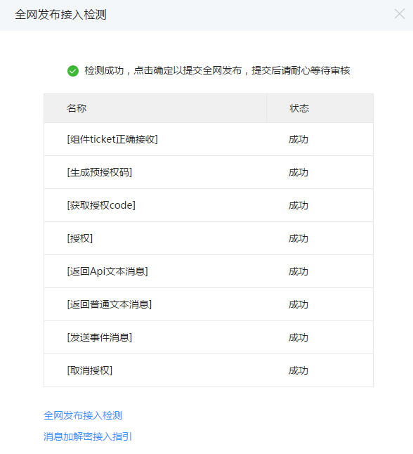
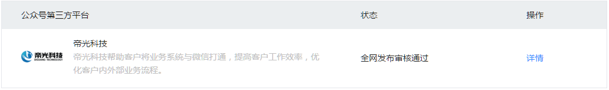
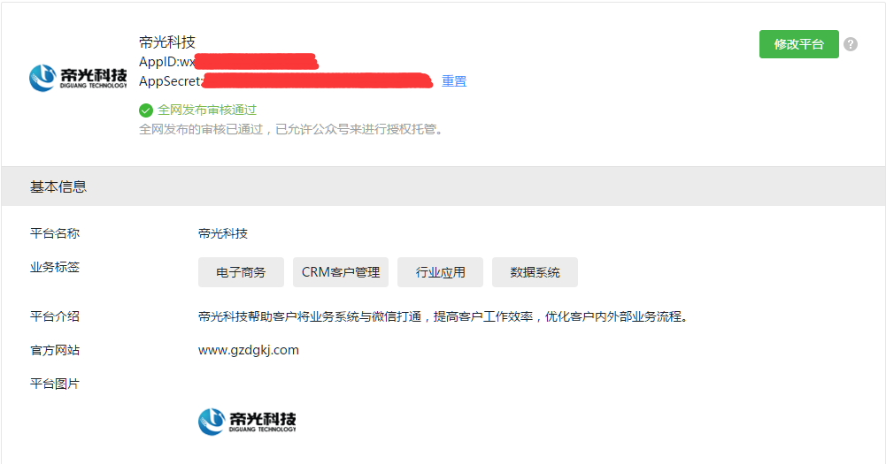

# Django with uwsgi in https://open.weixin.qq.com

------

微信是一个时代的标志，虽然它现在不温不火，但我们大部分人离不开它。最近我帮朋友的公司接入了微信公众号第三方，使其成为第三方开发者。

- - -
## 项目截图
在开始介绍这个项目之前我们先来看几张这个demo的截图：




- - -
## 项目文档
[微信公众号第三方平台开发python教程 Part 1](http://dev.cppfun.com/develop-wechat-public-third-party-platforms-in-python-part-one.htm)
[微信公众号第三方平台开发python教程 Part 2](http://dev.cppfun.com/develop-wechat-public-third-party-platforms-in-python-part-two.htm)
[微信公众号第三方平台开发python教程 Part 3](http://dev.cppfun.com/develop-wechat-public-third-party-platforms-in-python-part-three.htm)
[微信公众号第三方平台开发python教程 Part 4](http://dev.cppfun.com/develop-wechat-public-third-party-platforms-in-python-part-four.htm)
[微信公众号第三方平台开发python教程 Part 5](http://dev.cppfun.com/develop-wechat-public-third-party-platforms-in-python-part-five.htm)
[微信公众号第三方平台开发python教程 Part 6](http://dev.cppfun.com/develop-wechat-public-third-party-platforms-in-python-part-six.htm)
[微信公众号第三方平台开发python教程 Part 7](http://dev.cppfun.com/develop-wechat-public-third-party-platforms-in-python-part-seven.htm)
[微信公众号第三方平台开发python教程 Part 8](http://dev.cppfun.com/develop-wechat-public-third-party-platforms-in-python-part-eight.htm)
[微信公众号第三方平台开发python教程 Part 9](http://dev.cppfun.com/develop-wechat-public-third-party-platforms-in-python-part-nine.htm)

- - -
## 代码介绍
下面我对整个代码做简单的解释：
- com_ticket.json （ticket）
- com_access_token.json （存储component_access_token）
- pre_auth_code.json （存储pre_auth_code）
- wxopen/wxopenserver.py （微信公众号第三方服务端验证，消息加解密和API）
- wxopen/wxopenclient.py （微信公众号服务端api）
- ... （其余代码比较好理解，这里不再叙述）


- - -
## 应用log设置
```ini
LOGGING = {
    'version': 1,
    'disable_existing_loggers': False,
    'handlers': {
        'file': {
            'level': 'DEBUG',
            'class': 'logging.FileHandler',
            'filename': BASE_DIR+'/info.log',
        },
    },
    'loggers': {
        'django': {
            'handlers': ['file'],
            'level': 'DEBUG',
            'propagate': True,
        },
        'wxopen': {
            'handlers': ['file'],
            'level': 'DEBUG',
            'propagate': True,
        },

    },
}
```

- - -
## uwsgi设置
```ini
# wechat_uwsgi.ini file
[uwsgi]

# Django-related settings
# the base directory (full path)
chdir           = /home/project/wechat
# Django's wsgi file
module          = wechat.wsgi

# process-related settings
# master
master          = true
# maximum number of worker processes
processes       = 10
# the socket (use the full path to be safe
socket          = /home/project/wechat/wechat.sock
# ... with appropriate permissions - may be needed
chmod-socket    = 664
uid             = www
gid             = www
enable-threads  = true
# clear environment on exit
vacuum          = true
env = DJANGO_SETTINGS_MODULE=wechat.settings
# set an environment variable
safe-pidfile = /tmp/wechat-master.pid # create a pidfile
# limit-as = 256 # limit the project to 128 MB
daemonize = /var/log/uwsgi/wechat-dj.log # background the process & log
threads = 128
harakiri = 120
max-requests = 9999
socket-timeout = 120
reload-on-as = 256
reload-on-rss = 200
```

* * *
## 说明
《微信公众号第三方平台》python版本；
Django，PostgreSQL，nginx和uwsgi的知识这里不作介绍，用心其实它们的结合也没那么难。

License
- 2016-05

MIT

*http://dev.cppfun.com*


