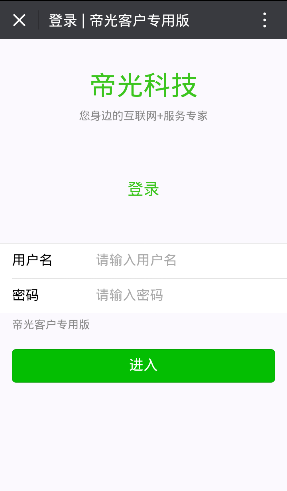
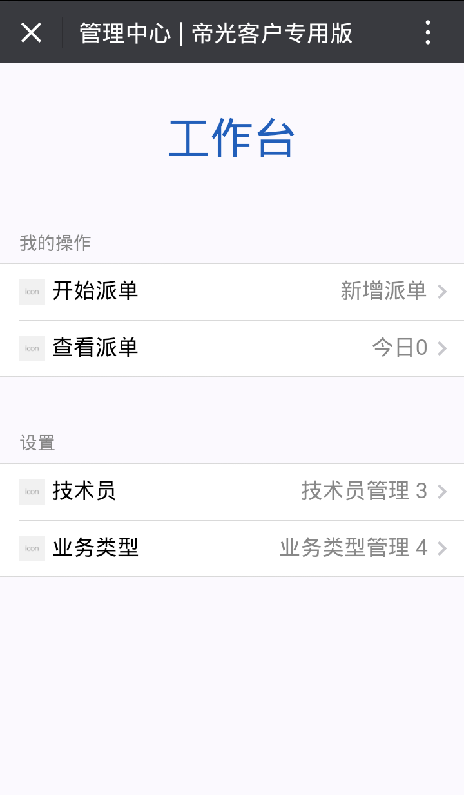
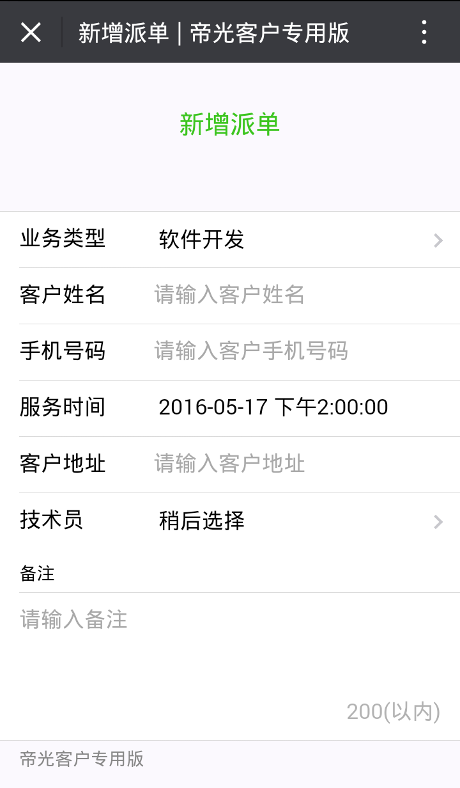
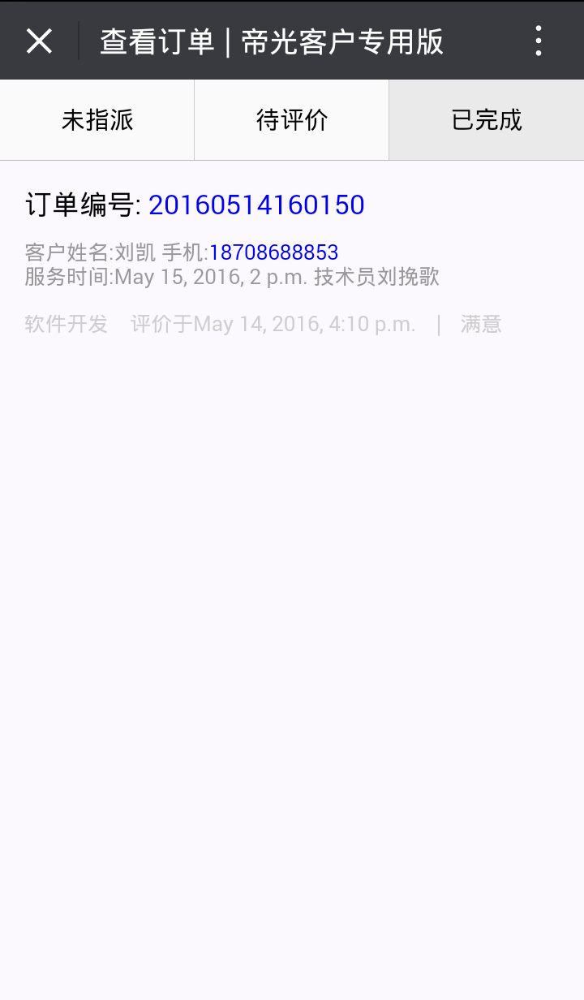
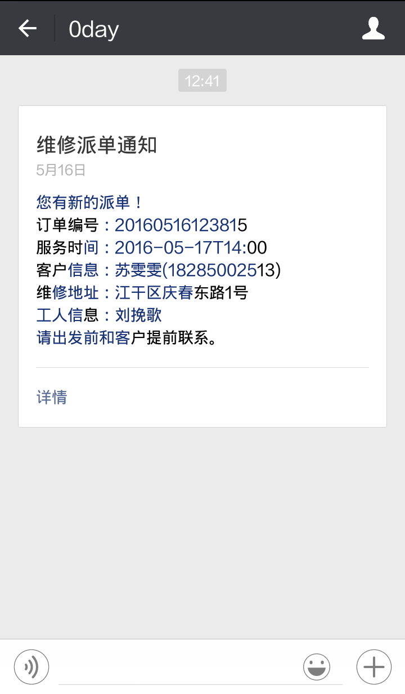
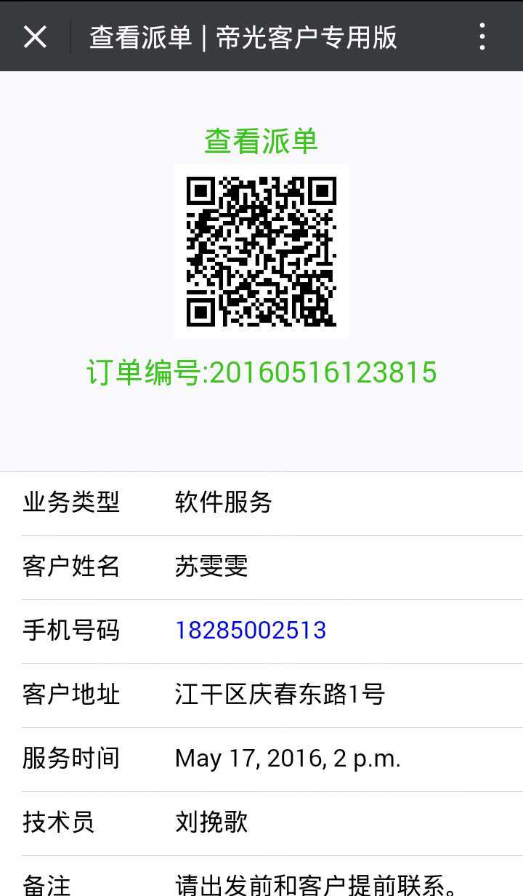
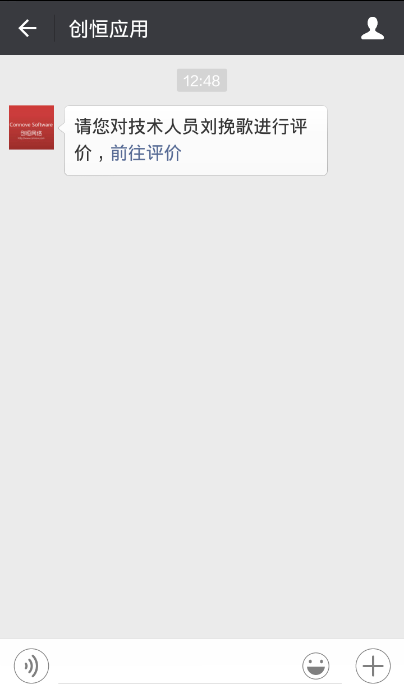
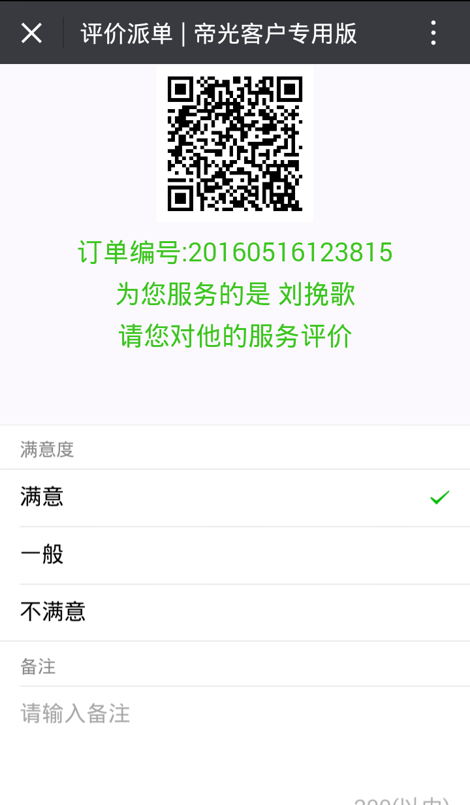

# Django with uwsgi in https://mp.weixin.qq.com

------

该项目位置：[cppfun@wechat](https://github.com/cppfun/wechat)
微信公众平台的python版本已经有很多例子，在github上也有很多python版本的开发包，但我个人觉得这些家伙的文档都写得很差，包括微信公众号官方上面的文档也很一般。

- - -
## 应用截图
在开始介绍这个项目之前我们先来看几张这个demo的截图：









- - -
## 应用场景
这是一个基于公众号的简单派单及评价应用。大概场景如下：
- 管理员管理业务类型及技术人员，并为技术人员指派新的订单；
- 技术人员在微信端收到派单通知；
- 技术人员在处理完订单后邀请客户扫码进行评价。
*这里面用到微信公众号最新的用户标签和生成带参数的临时二维码*

- - -
## 代码介绍
下面我对整个代码做简单的解释：
- access_token.json （存储token）
- jsapi_ticket.json （存储ticket）
- set_data.json （存储用户组标签ID）
- wxser.py （微信公众号服务端验证）
- jssdk.py （微信公众号服务端api）
- ... （其余代码比较好理解，这里不再叙述）

- - -
## 服务端关键api介绍
### 获取tagid
```python
    def getTagId(self):
        set_data = open('set_data.json')
        data = json.load(set_data)
        set_data.close()
        if data['tagid']:
            return data['tagid']
        else:
            return 101
```
### 获取分组用户列表
```python
    def getTechUsers(self):
        url = "https://api.weixin.qq.com/cgi-bin/user/tag/get?access_token=%s" % (self.getAccessToken())
        payload = {'tagid': self.getTagId(), 'next_openid': ''}
        headers = {'content-type': 'application/json'}
        response = requests.post(url, data=json.dumps(payload), headers=headers)
        data = response.json()
        print data
        openids = data['data']['openid']
        return openids
```
### 获取用户信息
```python
    def getUserInfo(self, openid):
        # https://api.weixin.qq.com/cgi-bin/user/info?access_token=ACCESS_TOKEN&openid=OPENID&lang=zh_CN
        url = "https://api.weixin.qq.com/cgi-bin/user/info?access_token=%s&openid=%s&lang=zh_CN" \
              % (self.getAccessToken(), openid)
        response = requests.get(url)
        return response.json()
```
### 生成带参数二维码并获取路径
```python
    def getQcodeUrl(self, oid):
        url = "https://api.weixin.qq.com/cgi-bin/qrcode/create?access_token=%s" % (self.getAccessToken())
        payload = {'expire_seconds': 2591999, 'action_name': 'QR_SCENE', 'action_info': {"scene": {"scene_id": oid}}}
        headers = {'content-type': 'application/json'}
        response = requests.post(url, data=json.dumps(payload), headers=headers)
        data = response.json()
        ticket = data['ticket']
        # http://weixin.qq.com/q/zUipXRjlo7zaLJROUmaT
        # print data['url']
        url_qcode = "https://mp.weixin.qq.com/cgi-bin/showqrcode?"
        params = {'ticket': ticket}
        from urllib import urlencode
        # Content-Type:image/jpg
        return url_qcode + urlencode(params)
```
### 发送模板消息
```python
    def sendTemplateMsg(self, send_data):
        url = 'https://api.weixin.qq.com/cgi-bin/message/template/send?access_token=%s'\
              % (self.getAccessToken())
        # send_data = {
        #     "touser":'oV9A7sx6y838j3rSFfgECitC-zbE',
        #     "template_id":"JSyp6FLF1j1cqJLZRRV5n_ccDqlMYoTu_gfIx3RonOE",
        #     "url":'http://wx.3wyes.com',
        #     "data":{
        #            "first": {
        #                "value":"请您对我们工作人员的服务评价！",
        #                "color":"#173177"
        #            },
        #            "keyword1":{
        #                "value":'20160506220527',
        #                "color":"#173177"
        #            },
        #            "keyword2": {
        #                "value":'2016-05-07 13:00',
        #                "color":"#173177"
        #            },
        #            "keyword3": {
        #                "value":'刘XXX',
        #                "color":"#173177"
        #            },
        #            "keyword4": {
        #                    "value":'南明区遵义路万象国际Ｃ座18-16号',
        #                    "color":"#173177"
        #                },
        #            "keyword5": {
        #                    "value":'钟小鸣[工号:003]',
        #                    "color":"#173177"
        #                },
        #            "remark":{
        #                "value":"以上是您的服务信息，请您对我们员工的服务做出评价，谢谢！",
        #                "color":"#173177"
        #            }
        #     }
        # }
        headers = {'content-type': 'application/json'}
        response = requests.post(url, data=json.dumps(send_data), headers=headers)
        data = response.json()
        return data
```
### 获取所有模板消息
```python
    def getTemplate(self):
        url = 'https://api.weixin.qq.com/cgi-bin/template/get_all_private_template?access_token=%s' \
              % (self.getAccessToken())
        resp = requests.get(url)
        data = resp.json()
        return data
```

- - -
## 应用log设置
```ini
LOGGING = {
    'version': 1,
    'disable_existing_loggers': False,
    'handlers': {
        'file': {
            'level': 'DEBUG',
            'class': 'logging.FileHandler',
            'filename': BASE_DIR+'/info.log',
        },
    },
    'loggers': {
        'django': {
            'handlers': ['file'],
            'level': 'DEBUG',
            'propagate': True,
        },
        'wxorder': {
            'handlers': ['file'],
            'level': 'DEBUG',
            'propagate': True,
        },

    },
}
```

- - -
## uwsgi设置
```ini
# wechat_uwsgi.ini file
[uwsgi]

# Django-related settings
# the base directory (full path)
chdir           = /home/project/wechat
# Django's wsgi file
module          = wechat.wsgi

# process-related settings
# master
master          = true
# maximum number of worker processes
processes       = 10
# the socket (use the full path to be safe
socket          = /home/project/wechat/wechat.sock
# ... with appropriate permissions - may be needed
chmod-socket    = 664
uid             = www
gid             = www
enable-threads  = true
# clear environment on exit
vacuum          = true
env = DJANGO_SETTINGS_MODULE=wechat.settings
# set an environment variable
safe-pidfile = /tmp/wechat-master.pid # create a pidfile
# limit-as = 256 # limit the project to 128 MB
daemonize = /var/log/uwsgi/wechat-dj.log # background the process & log
threads = 128
harakiri = 120
max-requests = 9999
socket-timeout = 120
reload-on-as = 256
reload-on-rss = 200
```

* * *
## 说明
该应用只是一个很小的demo，消息加解密我会在《微信公众号第三方平台》接入时进行介绍。
django，PostgreSQL，nginx和uwsgi的知识这里不作介绍，用心其实它们的结合也没那么难。

License
- 2016-05

MIT

*http://dev.cppfun.com*


